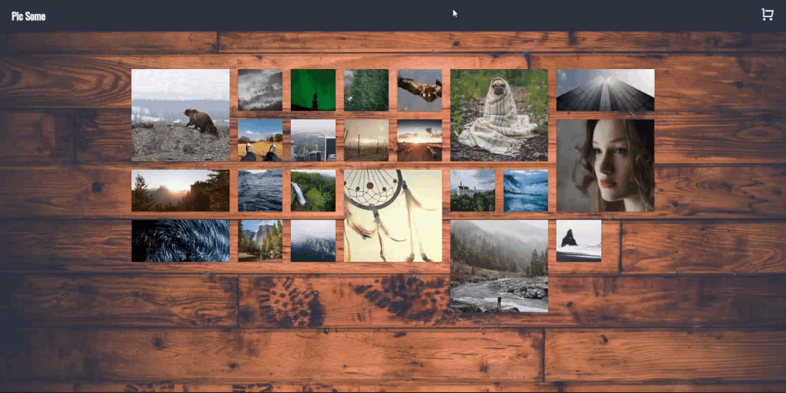

# PicSome

## How To Install/Run Repo

1.  Clone or download from GitHub
2.  From the terminal, _cd_ into the **picsome** directory
3.  Run _npm i_ to install all dependencies
4.  Run _npm start_ to begin the application on your localhost server

## Purpose Of The App

This is a repository for the PicSome application where you can buy pictures online.

**The ordering process is just for the UI and you are not actually buying pictures when selecting the Order button.**

### Liking Images

Each picture can be liked by clicking on the heart icon(in the top-left of the image) when hovering over any pictures.

## Adding Images to the Checkout Cart

Adding images to the cart is very similar to liking an image. Each image has a cart icon in the top right of the image. Clicking this cart icon will add that image to the checkout cart.

## Checking Out

The final process would be to buy the images you've added to the cart. Once you've gotten to the checkout page, you can delete any images you've decided against by clicking the trashcan icon to the left of each image.

Once you are ready to buy the images, click Place Order and the order button will change to Ordering... for 2 seconds before clearing the cart, and changing the button back to Place Order.

You can then click PicSome on the navbar to get back to the main images page.

